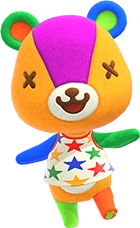
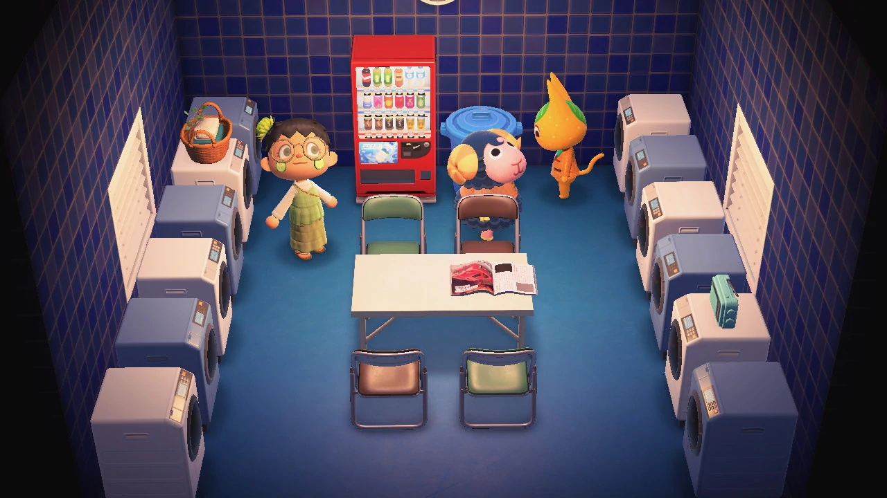

```{r setup, include=FALSE}
#knitr::opts_chunk$set(cache = TRUE, message = FALSE, warning = FALSE)
```

# Intro 

---


#strumento usato dai protestanti di Hong kong e dalla PETA


## Scopo: 

> - verificare quando il gioco sia bilanciato nella distribuzione delle varie caratteristiche degli abitanti


```{r message=FALSE, warning=FALSE}
library(readr)

pathMaker = function(fileName) {
  return (paste("../1_setdati/ACNH/", fileName, ".csv", sep = ""))
  }

villagers = read_csv( pathMaker("villagers") )
```

---  

```{r}
head(villagers)
```


# Species/Sex distribution

## Let's take a closer look at the available species and genders in the game

```{r}
unique(villagers$Species)
```

- "Cub" are Baby bear, for some reason are separate from "Bear".
- "Cow" and "Bull" are not treated as the same species.
- Gorillas are *not* a type of monkey, they are apes, which seems to be different.

---

```{r}
unique(villagers$Gender)
```


- There are just two genders, which is curious because there are a bunch of villagers that are not living being.

- <div style = "text-align:center" >     </div>

## custom tibble

Let's create a custom tibble that will allow us to classify the various species of animal

```{r message=FALSE, warning=FALSE}
library(dplyr)
library(tidyr)
```

```{r}
# tribble allows a creation of tibble written per rows
animalClasses = tribble(
  ~Class,     ~Species,
  "Mammal",   "Squirrel/Pig/Gorilla/Koala/Anteater/Bull/Mouse/Cat/Horse/Hamster/Kangaroo/Wolf/Elephant/Sheep/Deer/Tiger/Cub/Dog/Bear/Hippo/Goat/Rabbit/Lion/Monkey/Rhino/Cow",
  "Bird",     "Bird/Duck/Penguin/Ostrich/Eagle/Chicken",
  "Amphibia", "Frog",
  "Reptile",  "Alligator",
  "Fish",     "Octopus"
)

# Saving some digital ink
animalClasses = separate_rows(animalClasses, Species, sep="/")

animalClasses

```

- Mammals have the highest amount of variety of species, followed by Birds.
- Amphibia, Reptiles and Fishes only have one species each!

---

```{r}
# updating villagers variable so in the future also has Class
villagers = left_join(villagers, animalClasses)

# check if any species was miss in animalClasses
sum(is.na(villagers$Class))
```

---

```{r}

speciesFreq = villagers %>%
  count(Class, Species, name = "Species_count") %>%
  arrange(-Species_count) %>%
  mutate(Species = reorder(Species, Species_count))

speciesFreq
```

Seems that Nintendo prefers Cats over Dogs...

## relative & absolute frequency and average

```{r}
speciesFreq %>%
  group_by(Class) %>%
  summarize(Class_count = sum(Species_count), Class_avg = mean(Species_count) ) %>%
  ungroup() %>%
  mutate(Class_count_rel = Class_count/sum(Class_count) ) %>%
  arrange(-Class_count_rel)

```

- Mammals are also the most frequent species available, we then have Birds, Amphibia, Reptiles and Fishes.
- Seems that the distribution follows the Pareto Principle.

# Gender and species distribution

## Species frequency

```{r}
library(ggplot2)

speciesFreq %>%
  mutate(Species = reorder(Species, Species_count)) %>%
  ggplot( aes(x = Species_count, y = Species, fill = Class ) ) +
    geom_col()
```

## Gender distribution in species

```{r}
GenderFreq = villagers %>%
  count(Species, Gender) %>%
  left_join(speciesFreq) %>%
  arrange(-n) %>%
  # forcing the order to the absolute frequency of the species
  mutate(Species = reorder(Species, Species_count))

GenderFreq

GenderFreq %>%
  ggplot( aes(x = n, y = Species, fill = Class ) ) +
    geom_col(show.legend = FALSE) +
    facet_wrap(~Gender)

```

## Gender ratio

```{r}
GenderDistr = GenderFreq %>%
  group_by(Species, Class, Species_count) %>%
  spread(Gender, n) %>%
  # ifelse is to deal with NA without using fill(0) afterwards
  summarize(
    Female = ifelse( is.na(sum(Female)), 0, sum(Female) ), 
    Male = Species_count - Female ) %>%
  ungroup() %>%
  mutate(
    Female_rel = Female / Species_count, 
    Male_rel = 1 - Female_rel) %>%
  arrange(-Species_count)

GenderDistr

```

## Gender bias in species

```{r}
GenderDistr %>%
  filter(Species_count > 10, abs(Female_rel - 0.5) > 0.2)
```

- There is any connection with reality? (**NOTE:** my search was superficial)

- *Frogs*: [This research](https://www.researchgate.net/publication/42608407_Sex_reversal_and_primary_sex_ratios_in_the_common_frog_Rana_temporaria) may suggest that there are more female frogs than male!

- *Squirrels*: [Yellow ground squirrels](https://advances.sciencemag.org/content/1/9/e1500401) seems to have sex bias in favor of female while [Red squirrels](https://www.researchgate.net/publication/238009290_Male-biased_sex_ratios_in_a_red_squirrel_population) seems to have sex bias towards of males, this last statistic may be skewed.

- *Sheeps*: [This study](https://www.tandfonline.com/doi/abs/10.1080/03033910.1996.10558087) suggest a sex bias of newborns correlated to age of the parents, but nothing as strong as expected (this is we don't consider the option to kill someone...)


# Personality distribution

---

```{r}
villagers %>%
  count(Personality, Gender) %>%
  arrange(n) %>%
  mutate(Personality = reorder(Personality, n)) %>%
  ggplot( aes(x = n, y = Personality, fill = Gender ) ) +
    geom_col(show.legend = FALSE) +
    facet_grid(~Gender)
```

-Seems that "Lazy" is the normal state of males.

# Style distribution

---

```{r}
style_distribution = villagers %>%
  count(Style_1, Style_2, Gender) %>%
  spread(Gender, n) %>%
  replace_na(list(Female = 0, Male = 0)) %>%
  arrange( -(Female + Male) )  

style_distribution
```

---

```{r}
style_distribution %>%
  top_n(5, Female)

style_distribution %>%
  top_n(5, Male)
```

I wonder why cool and cute are two different things...

---

```{r}
style_distribution %>%
  ggplot( aes(x = Style_1, y = Style_2, size = Female + Male, color = Male > Female ) ) +
    geom_count() +
    theme_minimal() +
    labs(x = "Primary Style", y = "Secondary Style")
```

- Note that there is not a perfect simmetry. Some examples:
- Cute-Simple is more frequent than Simple-Cute.
- Elegant-Active is mostly female while Active-Elegant is mostly male.


# Furniture study: who spend the most?

---

```{r}
#creating new tibbles 
villager_wall_floor = villagers %>%
  select(Name, Wallpaper, Flooring) %>%
  unite(Wallpaper, Flooring, col = Furniture_name, sep = ";") %>%
  separate_rows(Furniture_name, sep = ";")

villager_wall_floor

villager_furnitures = villagers %>%
  select(Name, Class, Species, Gender, Personality, Style_1, Style_2, Furniture_List) %>%
  separate_rows(Furniture_List, sep=";") %>%
  
  # Renaming the column because it is no longer a list
  mutate(`Internal ID` = as.numeric(Furniture_List) ) %>%
  count(Name, Class, Species, Gender, Personality, Style_1, Style_2, `Internal ID`, name = "Furniture_count") %>%
  arrange(-Furniture_count)

villager_furnitures
  
```

- Most of the Owned piece are identified by their internal ID, which is not really human friendly.

## Preparing the joins

```{r}
floor = read_csv( pathMaker("floors") )
wallmounted = read_csv( pathMaker("wall-mounted") )
houseware = read_csv( pathMaker("housewares") )
miscellaneous = read_csv( pathMaker("miscellaneous") )
rug = read_csv( pathMaker("rugs") )
wallpaper = read_csv( pathMaker("wallpaper") )

head(floor)
```

---

There're plenty of columns we are not going to use. 

```{r}
cleaningTibble = function(input) {
  # Converts the variable name to string
  inputAsString = deparse(substitute(input))
  
  input = input %>%
    select(`Internal ID`, Name, Buy, Sell ) %>%
    mutate(Furniture_type = inputAsString) %>%
    rename(Furniture_name = Name)
}
```

---

```{r}
catalogue = cleaningTibble(floor) %>%
  union( cleaningTibble(wallmounted) ) %>%
  union( cleaningTibble(houseware) ) %>%
  union( cleaningTibble(miscellaneous) ) %>%
  union( cleaningTibble(rug) ) %>%
  union( cleaningTibble(wallpaper) )
  
catalogue

#verifying if there are duplicate internal IDs
catalogue %>%
  count(`Internal ID`) %>%
  filter(n > 1)
```

NFS stands for Not for Sale

---


```{r}
villager_wall_floor2 = villager_wall_floor %>%
  left_join(catalogue) %>%
    mutate(Buy = as.numeric(Buy) )# automatically changes all NFS to NA

villager_wall_floor2
```

```{r}
villager_furnitures2 = villager_furnitures %>%
    left_join(catalogue) %>%
    mutate(Buy = as.numeric(Buy) )
  
villager_furnitures2
```

- I wonder whan "deluxe washer" is...
- Luckily the Wiki has some images of the interiors.

---

<div style = "text-align:center" ></div>

---

So, who has spent the most?

```{r}
villager_wall_floor_expense = villager_wall_floor2 %>%
  replace_na(list(Buy = 0)) %>%
  group_by(Name) %>%
  summarise(wall_floor_sum = sum(Buy)) %>%
  ungroup()

villager_expense = villager_furnitures2 %>%
  replace_na(list(Buy = 0)) %>%
  group_by(Name) %>%
  summarize(furniture_sum = sum(Furniture_count * Buy) ) %>%
  ungroup() %>%
  left_join(villager_wall_floor_expense) %>%
  replace_na( list(wall_floor_sum = 0) )  %>%
  mutate(total_expense = furniture_sum + wall_floor_sum) %>%
  arrange(-total_expense)

villager_expense
```

## Which is the distribution of classes of expense?

We'll define expense classes as the trunc of total_expense / 100000

```{r}
villager_expense = villager_expense %>%
  mutate(expense_class = trunc(total_expense/100000))

villager_expense %>%
  count(expense_class) %>%
  ggplot( aes(x = expense_class, y = n ) ) +
    geom_col(show.legend = FALSE) +
    labs(x = "expense x100000 bells", y = "frequency")
```

## How is expense distributed according species, hobby and personality?

```{r}
villager_expense2 = villagers %>%
  select(Name, Species, Personality, Hobby) %>%
  left_join(villager_expense) %>%
  
  #filtering extreme values
  filter(expense_class<5)

villager_expense2
```

## Expense per Species

```{r}
villager_expense2 %>%
  
  ggplot( aes(x = reorder(Species, total_expense), y = total_expense ) ) +
    geom_boxplot() +
    coord_flip()
```

## Expense class per Personality

```{r}
villager_expense2 %>%
  ggplot( aes(x = reorder(Personality, total_expense), y = total_expense ) ) +
    geom_boxplot() +
    coord_flip()
```

Lazy is a normal who saves money, that's the true difference!
- The extreme value may have skewed this result

## Expense class per Hobby

```{r}
villager_expense2 %>%
  ggplot( aes(x = reorder(Hobby, total_expense), y = total_expense ) ) +
    geom_boxplot() +
    coord_flip()
```

